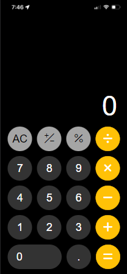

# calculator-app

## Project setup
```
npm install
```

## Compiles and hot-reloads for development
```
npm run serve
```

## Overview
This project aims to replicate an iOS Calculator using Vue.js.



## Features
The features of the application include:
> Addition

> Subtraction

> Multiplication

> Division

> Percentage

> Toggle Positive/Negative

> Clear All (AC)

> Clear Current (C)

## Technology Stack
Vue.js
> https://vuejs.org/

Bootstraps
> https://getbootstrap.com/

Boostrap Icon
> https://icons.getbootstrap.com/

FontAwesome
> https://fontawesome.com/start

## math.js
The application uses [math.js](https://api.mathjs.org/) to execute the mathematical operations.
